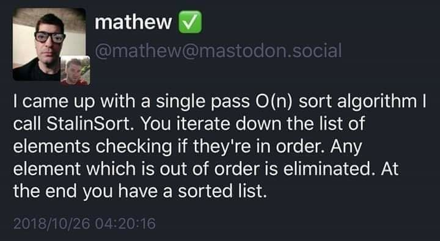

# Stalinsort

## What is Stalinsort?

It's a single-pass O(N) sorting algorithm. 

## How does it work?

You iterate down the list of elements checking if they're in order.
Any element which is out of order is eliminated. 
At the end you have a sorted list.

# Example use 

```python

> x =  [49, 28, 19, 66, 58, 15, 26, 7, 74, 42]
> stalinSort(x) # where x is an array of numerical elements 
> print(x)
> [49, -1, -1, 66, -1, -1, -1, -1, 74, -1]

```

# Idea source


